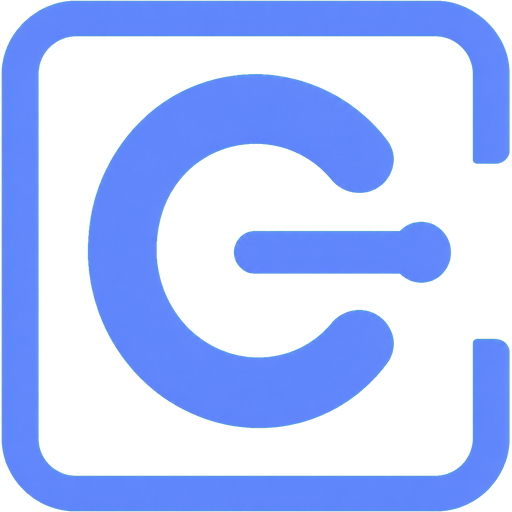
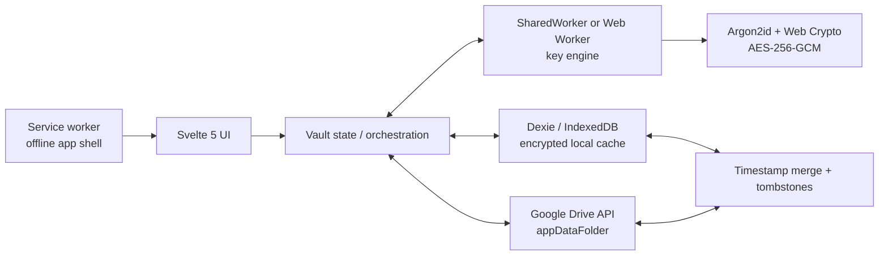

<p align="center">
  
</p>

<h1 align="center">Simple Vault</h1>

<p align="center">
  A private, offline-first password vault that encrypts everything in your browser and stores it in your Google Drive's isolated, app-specific storage.
</p>

<p align="center">
  <a href="https://vault.un.pe">Open the app</a> ·
  <a href="AUTH_STRATEGY.md">Unlock and app-lock design</a> ·
  <a href="PLAN.md">Storage format</a>
</p>

## Why Simple Vault?

Simple Vault is built for people who want a small password manager without operating or trusting another application backend. Google Drive is the vault's remote storage layer: encrypted data is kept in Drive's hidden `appDataFolder`, an area isolated for the application and unavailable to ordinary Drive files or other apps. Before anything is stored, the master password is processed locally with **Argon2id** to unlock a random data-encryption key, and vault contents are protected with authenticated **AES-256-GCM** encryption. This envelope-encryption design keeps the master password and plaintext data on the device. The app itself is a static PWA, all cryptographic operations run in the browser, and IndexedDB maintains the encrypted offline cache.

- **No application server** — deploy it as static files or use it entirely offline.
- **Client-side encryption** — plaintext vault contents and the master password are not sent to Google Drive.
- **Isolated storage in your account** — vault files live in Drive's hidden, app-specific `appDataFolder`, accessible only through Simple Vault's authorized Drive integration rather than exposed among regular Drive files.
- **Offline-first** — the service worker caches the app shell and IndexedDB keeps the encrypted local vault available without a connection.
- **Small sync units** — records are independently encrypted and grouped into per-folder binary files, so unrelated records are not re-encrypted on every edit.
- **Portable backups** — export encrypted `.svault` snapshots, import them on another device, or maintain up to ten encrypted historical snapshots in Drive.
- **Open implementation** — the cryptography, persistence, sync, and file formats are documented and testable in this repository.

## Features

### Vault management

- Store a title, username, password, site URL, notes, and folder for each item.
- Search by title or username and filter items by folder.
- Generate cryptographically random 20-character passwords.
- Keep up to 50 previous passwords per record; history is encrypted separately and loaded only when requested.
- Copy passwords with a best-effort clipboard clear after 40 seconds.
- Soft-delete records with tombstones so deletions propagate across devices.

### Access and recovery

- Unlock with a master password or the generated recovery key.
- Optionally unlock with the device's platform authenticator through WebAuthn PRF (fingerprint, face, or the device PIN/pattern).
- Fall back to a separate Argon2id-stretched app PIN on devices without a suitable authenticator.
- Configure background auto-lock: immediately, 30 seconds, 1 minute, 5 minutes, or never.
- Change the master password by rotating the data key and re-encrypting the vault.
- Download the current recovery key or generate a replacement that invalidates the old one.

### Sync and backup

- Continue working from the encrypted local cache while offline and synchronize with Drive after reconnecting.
- Perform two-way Drive synchronization with a 60-second debounce after local record changes.
- Merge records, histories, folders, and deletion tombstones using their update timestamps.
- Validate and authenticate remote ciphertext before accepting it.
- Export or fully restore a current-format encrypted `.svault` backup.
- Preview a backup after unlocking it, then merge its records into the current vault without replacing the current keys.
- Create, download, and restore encrypted Drive snapshots; the newest ten are retained.

## Architecture



| Layer | Responsibility |
| --- | --- |
| `src/routes` and `src/lib/ui` | SPA screens, onboarding, vault CRUD, settings, restore, and backup management. |
| `src/lib/app/vault.svelte.ts` | Central Svelte state and orchestration for sessions, local storage, sync, and backup workflows. It intentionally holds no long-lived key material. |
| `src/lib/worker` | Owns the unlocked data-encryption key and performs sensitive encryption/decryption away from the main UI thread. A `SharedWorker` is preferred, with a regular Worker fallback. |
| `src/lib/crypto` | AES-256-GCM primitives, Argon2id derivation, key wrapping, recovery keys, and the vault header. |
| `src/lib/db` | Dexie repository over IndexedDB for encrypted records, encrypted folder data, sync metadata, and device-local unlock material. |
| `src/lib/vault` | Compact IDs, CBOR codecs, authenticated folder files, and `.svault` backup encoding. |
| `src/lib/drive` and `src/lib/sync` | Google Identity Services, Drive `appDataFolder` I/O, and last-write-wins reconciliation. |
| `src/service-worker.ts` | Versioned caching of same-origin application assets for offline use; OAuth and Drive traffic are never cached. |

### Data flow

1. The master password or recovery key is processed with **Argon2id** to derive a key-encryption key (KEK).
2. The KEK unwraps a random 256-bit data-encryption key (DEK). The password itself is never used to encrypt records directly.
3. The DEK lives in the key Worker and encrypts folder names, record data, and password histories with **AES-256-GCM**.
4. The browser caches encrypted components in IndexedDB and serializes the same ciphertext into per-folder CBOR files stored in Drive's `appDataFolder`.
5. Other devices download, validate, authenticate, and merge folder files by ID and `updated` timestamp. Higher timestamps win; deleted records remain as tombstones.

### Drive layout

The current storage generation is v3:

```text
simple-vault.v3.header.json              # KDF parameters and wrapped DEK
simple-vault.v3.folder.<folder-id>.svf   # encrypted folder name and records
simple-vault.v3.backup.<timestamp>.svault # encrypted historical snapshot
```

Folder payloads and backups are positional CBOR. Each encrypted blob is stored as `12-byte IV || ciphertext || 16-byte authentication tag`, avoiding Base64 overhead except at JSON/text boundaries.

## Security model

Simple Vault uses envelope encryption:

```text
master password ──Argon2id──> password KEK ─┐
                                            ├──> unwrap DEK ──AES-256-GCM──> vault data
recovery key ─────Argon2id──> recovery KEK ─┘
```

- Default Argon2id cost: 64 MiB memory, 3 iterations, parallelism 1, 32-byte output.
- Every encrypted component gets a fresh 12-byte IV and a 16-byte GCM authentication tag.
- Component type, folder ID, record ID, and update time are authenticated as AES-GCM additional data, preventing ciphertext from being moved between records or contexts unnoticed.
- Record data and password history are separate ciphertexts. History is not decrypted for normal card rendering.
- The UI requests only title and username for cards; password, URL, notes, and history are decrypted for explicit actions.
- Drive access uses the narrow `drive.appdata` OAuth scope. The access token is kept in memory and cached only in `sessionStorage` until expiry.
- WebAuthn and app-PIN wrappers are local to one device and are never synced.

Some metadata remains visible by design. IndexedDB and binary folder containers expose identifiers, timestamps, deletion state, folder membership, counts, and approximate file sizes. Folder names and record fields remain encrypted. Google Drive can also observe file names, sizes, and modification metadata.

> [!IMPORTANT]
> Device unlock with WebAuthn PRF is the strongest quick-unlock path because the wrapping secret is gated by the platform authenticator. The separate app PIN is a convenience fallback and can be brute-forced offline if an attacker copies the browser database. Its five-attempt limit protects only the application UI, not an extracted database. See [AUTH_STRATEGY.md](AUTH_STRATEGY.md) for the complete rationale and limitations.

## Use the hosted app

Open [vault.un.pe](https://vault.un.pe) and connect Google Drive to create or retrieve your encrypted vault in its app-specific storage. A local-only setup remains available for development, evaluation, or use without cross-device synchronization. Install Simple Vault from your browser's PWA/install menu for an app-like experience and offline access.

On first setup:

1. Choose a strong master password of at least eight characters.
2. Download and safely store the recovery key shown once during onboarding.
3. Optionally connect Drive and enable device unlock or an app PIN in Settings.
4. Create an encrypted backup before relying on the vault across devices.

## Local development

### Requirements

- [Bun](https://bun.sh/) for dependency installation, tests, and the publishing script.
- A modern browser with Web Crypto, IndexedDB, Workers, and service worker support.
- Google Chrome or Chromium for the optional end-to-end smoke test.
- A Google OAuth client only if you want to test Drive synchronization.

### Setup

```sh
git clone https://github.com/ivanjoz/simple-vault.git
cd simple-vault
bun install
cp .env.example .env
bun run dev --open
```

The app can be developed in local-only mode without Google credentials. To enable Drive:

1. Create a project in [Google Cloud Console](https://console.cloud.google.com/).
2. Enable the Google Drive API and configure the OAuth consent screen.
3. Create an OAuth 2.0 **Web application** client.
4. Add the development origin, normally `http://localhost:5173`, to **Authorized JavaScript origins**.
5. Put the client ID in `.env`:

```dotenv
PUBLIC_GOOGLE_CLIENT_ID="YOUR_CLIENT_ID.apps.googleusercontent.com"
```

No client secret is used: authentication is the Google Identity Services browser token flow.

### Commands

| Command | Purpose |
| --- | --- |
| `bun run dev` | Start the Vite development server. |
| `bun run build` | Create the static production build in `build/`. |
| `bun run preview` | Serve the production build locally. |
| `bun test` | Run the unit test suite. |
| `bun run check` | Run Svelte and TypeScript checks. |
| `bun run check:lib` | Type-check the library modules directly. |
| `bun run e2e` | Run the onboarding/CRUD smoke test against `http://localhost:4173`. |
| `bun run publish` | Build and replace `docs/` for the GitHub Pages deployment. |

To run the end-to-end test, start a preview server in one terminal and the test in another. Override `CHROME_PATH` or `E2E_URL` if needed.

```sh
bun run build
bun run preview

# second terminal
CHROME_PATH=/usr/bin/google-chrome bun run e2e
```

## Version and compatibility

- Simple Vault is currently at **version 0.1.0**.
- Drive/blob storage generation is v3, while the internal key header remains format 2.
- There is no migration path for older Drive folder blobs. Versioned Drive filenames prevent the current app from silently overwriting an older layout.
- Record IDs are timestamp-derived and can collide if generated in the same millisecond.
- Conflict resolution uses Unix time in whole seconds; simultaneous edits within one second are treated as the same logical revision.
- WebAuthn PRF support varies by browser and platform and requires a secure context. Test device unlock on real target devices.

The detailed format and accepted tradeoffs are documented in [PLAN.md](PLAN.md).

## Contributing

Issues, design discussions, documentation improvements, tests, and focused pull requests are welcome. Before proposing a cryptographic or storage-format change, read [PLAN.md](PLAN.md) and [AUTH_STRATEGY.md](AUTH_STRATEGY.md), and include tests that cover compatibility and failure cases.

Before opening a pull request, run:

```sh
bun test
bun run check
bun run check:lib
bun run build
```

## License

Simple Vault is free and open-source software licensed under the [GNU General Public License v3.0](LICENSE). You may use, study, modify, and redistribute it under the terms of that license. Distributed modifications and derivative works must remain available under GPLv3.
